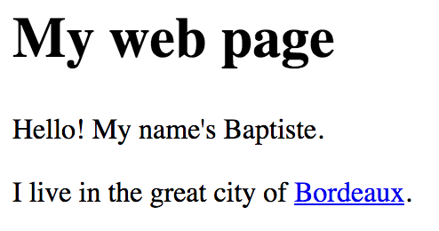

# What's a web page?

This short chapter summarizes what you need to known about the Web and web pages.

## TL;DR

* The Web

* HTML/CSS/JS

* Browser

* Dev tools

## Internet and the Web

As you probably know, the [World Wide Web](https://en.wikipedia.org/wiki/World_Wide_Web) (or **Web** for short) is an ever-expanding information space built on top of the [Internet](https://en.wikipedia.org/wiki/Internet). Web resources are accessible via their address, called their [URL](https://en.wikipedia.org/wiki/Uniform_Resource_Locator), and can contain [hyperlinks](https://en.wikipedia.org/wiki/Hyperlink) to other resources. Together, all these interlinked resources form a huge mesh analogous to a spider web.

Documents suitable for the Web are called **web pages**. They are grouped together on **websites** and primarily visited through a special kind of software called a [browser](https://en.wikipedia.org/wiki/Web_browser).

## The languages of the Web

There are three main technologies for creating web pages: HTML, CSS and JavaScript.

### HTML

HTML, short for [HyperText Markup Language](https://en.wikipedia.org/wiki/HTML), is the document format of web pages. An HTML document is made of text and structural elements called **tags**. Tags are used to describe the page content: paragraphs, headings, hyperlinks, images, etc.

Here is an example of a simple web page, usually stored as an `.html` file.

```html
<!doctype html>
<html>

<head>
    <meta charset="utf-8">
    <title>My web page</title>
</head>

<body>
    <h1>My web page</h1>
    <p>Hello! My name's Baptiste.</p>
    <p>I live in the great city of <a href="https://en.wikipedia.org/wiki/Bordeaux">Bordeaux</a>.</p>
</body>

</html>
```



Here are a few references for learning more about HTML:

* [Codecademy](https://www.codecademy.com/learn/web)
* [Khan Academy](https://www.khanacademy.org/computing/computer-programming/html-css)
* [Mozilla Developer Network](https://developer.mozilla.org/en-US/docs/Web/HTML)

### CSS

CSS, or [Cascading Style Sheets](https://en.wikipedia.org/wiki/Cascading_Style_Sheets), is a Language used to alter the presentation of web pages.

CSS uses **selectors** to declare which HTML elements a style applies to. Many selecting strategies are possible, most notably:

* All elements of a given name.
* Elements matching a given **class**.
* The element matching a given and unique **identifier** (id).

Here is an example of a simple CSS style sheet, usually stored as a `.css` file.

```css
/* All h1 elements are pink */
h1 {
   color: pink;
}

/* All elements with the class "done" are strike through */
.done {
  text-decoration: line-through;
}

/* The element having id "rude" is shown uppercase with a particular font */
#rude {
  font-family: monospace;
  text-transform: uppercase;
}
```

A style sheet is associated with an HTML document using a `link` tag in the `head` part of the page.

```html
<link href="path/to/file.css" rel="stylesheet" type="text/css">
```

### JavaScript

TODO

## The browser

TODO
