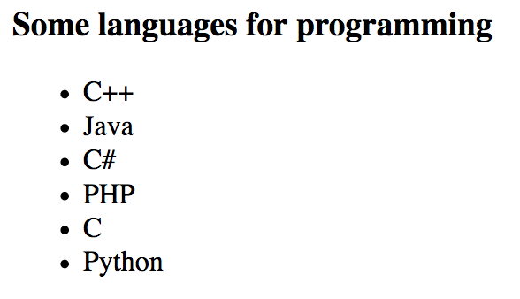
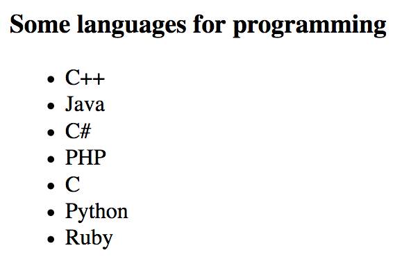

# Modify the page

Let's see how to use JavaScript to modify a web page once it's been loaded by the browser! You can thus make your content more dynamic and interactive.

## TL;DR

The innerHTML, textContent , and classList properties, as well as the setAttribute method, let you modify a DOM element's information.

    Create new DOM nodes via methods like createTextNode for, well, text nodes, and createElement for elements themselves.

    The appendChild method lets you insert a new node as the last child of a DOM element.

    The insertBefore and insertAdjacentHTML methods are alternative possibilities for adding content.

    You can replace existing nodes with the replaceChild method or remove them with removeChild .

    Manipulating the DOM with JavaScript should be done sparingly so that page performance doesn't suffer.

## Example page

The examples in this chapter all use the content below.

```html
<h1 class="beginning">Some languages</h1>
<div id="content">
    <ul id="languages">
        <li id="cpp">C++</li>
        <li id="java">Java</li>
        <li id="csharp">C#</li>
        <li id="php">PHP</li>
    </ul>
</div>
```

## Modify an existing element

The DOM traversal properties studied in the previous chapter can also be used to update elements in the page.

### HTML content

The `innerHTML` property can be used to change the content of an element within the DOM.

For example, you can add a new language to our list with the code below. We'll access the `<ul>` tag identified by `"languages"` and then add an entry to the end of the list via an operator (`+=`) and an `<li>`.

```js
// Modifying an HTML element: adding an <li>
document.getElementById("languages").innerHTML += '<li id="c">C</li>';
```


The `innerHTML` property is often used to "empty" content. Try the following example:

```js
// Delete the HTML content of the list, replacing it with nothing
document.getElementById("languages").innerHTML = "";
```

> Before moving on, remove the above line from your JavaScript program. Otherwise, you'll have no content!

T> When using `innerHTML`, you put some HTML content into strings. To keep your code readable and avoid mistakes, you should only use `innerHTML` to make small content changes. You'll discover more versatile solutions below.

### Text content

Use the `textContent` property to modify the text content of a DOM element. Here is how to complete the title displayed by our page.

```js
// Modify the title's text content
document.querySelector("h1").textContent += " for programming";
```


### Attributes

The `setAttribute()` method sets the value of an attribute of an element. You pass the name and value of the attribute as parameters.

```js
// Define the id attribute of the first title
document.querySelector("h1").setAttribute("id", "title");
```

As you saw in the previous chapter, some attributes exist as properties and can be directly updated.

```js
// Define the id attribute of the first title
document.querySelector("h1").id = "title";
```

### Classes

You can use the `classList` property to add or remove classes from a DOM element!

```js
const titleElement = document.querySelector("h1"); // Grab the first h1
titleElement.classList.remove("beginning");        // Remove the class "beginning"
titleElement.classList.add("title");               // Add a class called "title"
console.log(titleElement);
```


## Adding a new element

Adding a new element to a web page can be broken into three steps:

* Create the new element.
* Set element properties.
* Insert the new element in the DOM.

For example, suppose you want to add the language "Python" to the list of languages on our page. Here's the JavaScript code you'd use to do so.

```js
const pythonElement = document.createElement("li"); // Create an "li" element
pythonElement.id = "python";          // Define element ID
pythonElement.textContent = "Python"; // Define its text content
document.getElementById("languages").appendChild(pythonElement); // Insert the new element into the DOM
```



Let's study each of these steps.

### Creating the element

You'd create an element using the `createElement()` method (surprising, isn't it?). This method is used on the document object and takes the tag of the new element as a parameter. It returns the element created as an object (here stored in a variable called `pythonElement`).

```js
const pythonElement = document.createElement("li"); // Create an li element
```

### Setting element properties

Once the element's created and stored in a variable, you can add some detail to it (ID, class, text content, etc) by using the aforementioned DOM properties.

In the example, the element ID becomes `"python"` and its text content becomes `"Python"`.

```js
// ...
pythonElement.id = "python";          // Define element ID
pythonElement.textContent = "Python"; // Define its text content
```

### Inserting the element into the DOM

There are several techniques to insert a new node in the DOM. The most common is to call the `appendChild()` method on the element that will be the future parent of the new node. The new node is added to the end of the list of child nodes of that parent.

In our example, the new item is added as a new child of the `<ul>` tag identified by `"languages"`, after all the other children of this tag.

```js
// ...
document.getElementById("languages").appendChild(pythonElement); // Insert the new element into the DOM
```

## Variations on adding elements

### Adding a textual node

Instead of using the `textContent` property to define the new element's textual content, you can create a textual node with the `createTextNode()` method. This node can then be added to the new element with `appendChild()`.

The following code demonstrates this possibility by inserting the Ruby language at the end of the list.

```js
const rubyElement = document.createElement("li"); // Create an "li" element
rubyElement.id = "ruby"; // Define element ID
rubyElement.appendChild(document.createTextNode("Ruby")); // Define its text content
document.getElementById("languages").appendChild(rubyElement); // Insert the new element into the DOM
```



### Adding a node before another one

Sometimes, inserting a new node at the end of its parent's children list is not ideal. In that case, you can use the `insertBeforce()` method. Called on the future parent, this method takes as parameters the new node and the node before which the new one will be inserted.

As an example, here's how the Perl language could be inserted before PHP in the list.

```js
const perlElement = document.createElement("li"); // Create an "li" element
perlElement.id = "perl"; // Define element ID
perlElement.textContent = "Perl"; // Define its text content
// Insert the new element before the "PHP" node
document.getElementById("languages").insertBefore(perlElement, document.getElementById("php"));
```


### Determining the exact position of the new node

There is a method to more precisely define the position of inserted elements: insertAdjacentHTML . Call it on an existing element and pass it the position and a string of HTML characters that represent the new content to be added. The new content's position should be either:

    beforebegin : before the existing element

    afterbegin : inside the existing element, before its first child

    beforeend : inside the existing element, after its last child

    afterend : after the existing element

For more clarification on these confusing position names, check out the Mozilla Developer Network's excellent writeup.

This example uses insertAdjacentHTML to add JavaScript to the beginning of the list.

// Add an element to the beginning of a list

document.getElementById('languages').insertAdjacentHTML("afterBegin",

'<li id="javascript">JavaScript</li>');

## Replacing or removing nodes

### Replacing a node

Replace a DOM element via the replaceChild method. This replaces a child node of the current element with another node. The new node and node-to-be-replaced are passed as parameters (in that order)!

The example shows replacing the Perl line with bash instead.

var bashElement = document.createElement("li"); // Create an li element

bashElement.id = "bash"; // Define its id

bashElement.textContent = "Bash"; // Define its text content

// Replace the element identified by "perl" with the new element

document.getElementById("languages").replaceChild(bashElement, document.getElementById("perl"));

### Removing a node

Lastly, you can delete a node thanks to a method called removeChild , to which you'll pass the node-to-be-removed as a parameter.

// Remove the element with the "bash" id

document.getElementById("languages").removeChild(document.getElementById("bash"));

You should sparingly modify the DOM with JavaScript because doing so can slow down your web page. Creating and modifying elements before they're inserted into the DOM is the best way to maximize performance.
Summary

## Coding time!