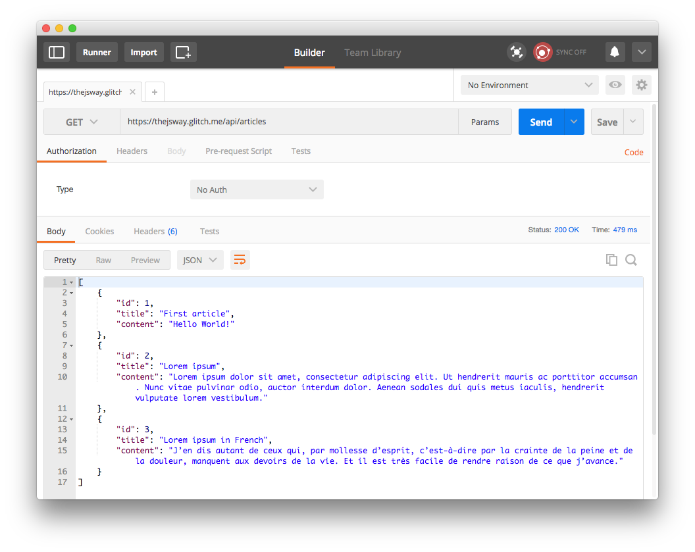

# Use web APIs

In this chapter, you'll learn how to leverage real-world web services in your applications.

## TL;DR

TODO

## Introducing web APIs

The **API** acronym stands for **Application Programming Interface**. An API is an entry point offered by a program or a service to other programs. It comes under the form of a set of well-defined methods of communication. Through APIs, developers can easily integrate external technologies or services in their applications.

APIs exist under a wide variety of forms. As an example, the Document Object Model is itself an API for interacting programmatically with a web page: it defines methods for navigating and updating the page structure.

A **web API** is an API available on the Web and accessible through web technologies, namely the HTTP protocol or its secured counterpart HTTPS. Web APIs are a key technology for software interactions: whenever you authenticate into a website using your Google account, or click a button to autopost something on your favorite social network, you're using them. A ever growing number of services are exposed through web APIs, forming a thriving ecosystem for building digital products.

## Consuming a web API

To be able to use a web API, you have to know its address and its usage mode. Most of web APIs are accessible via an **URL** and use the **JSON** format for data exchanges.

### Testing an API

The first web API you'll use here simulates a blog and exposes a series of articles, Its URL is <https://thejsway.glitch.me/api/articles>. Opening it in a browser shows the JSON data it returns.


This raw result is not easy to read. For an easier interaction with web API, using a specialized tool like [Postman](https://www.getpostman.com) or [RESTClient](https://addons.mozilla.org/fr/firefox/addon/restclient/) is strongly recommended. Here's how the result looks like on Postman.



> Curious about creating a web API? You'll learn how to build this very service (and others) in an upcoming chapter.

### Calling an API with JavaScript

Now that we know the address and data format of our example API, let's try to show its result on a web page. To do so, we'll leverage our AJAX knowledge from the previous chapter. Check out the following example, whichs show how to access the article list from the API.

Here's the HTML code for the page.

```html
<h2> Some blog articles</h2>
<div id="articles"></div>
```

And here's the associated JavaScript code.

```js
fetch("https://thejsway.glitch.me/api/articles")
  .then(response => response.json())
  .then(articles => {
    articles.forEach(article => {
      // Create title element
      const titleElement = document.createElement("h3");
      titleElement.textContent = article.title;
      // Create content element
      const contentElement = document.createElement("p");
      contentElement.textContent = article.content;
      // Add title and content to the page
      const articlesElement = document.getElementById("articles");
      articlesElement.appendChild(titleElement);
      articlesElement.appendChild(contentElement);
    });
  })
  .catch(err => {
    console.error(err.message);
  });
```

Using a web API works just like querying a web server: fetch the API URL, translating the JSON response into a JavaScript array and iterating on it.

Here is the result web page.


## Open web APIs

## Key-based authentication

## Coding time!

### Random user

### GitHub profile

### Grab a beer